# 综合改进计划：数字偏移 · 显示格式 · 命名整理 · 配置聚合评估 · 开发经验重扫

> **父计划**: `plan_config_overlay_refactor.md`（配置改造已完成）
> **分支**: `migration/neoforge-1.21.1`
> **基准提交**: `228fca7`
> **创建日期**: 2026-04-30

---

## 目标

完成 ClassicBar Overlay 层的 5 项综合改进任务：

1. **数字上移 2 像素** — 修正垂直偏移，使数值与图标视觉对齐
2. **数值显示格式** — 引入三种显示模式（仅当前值 / 当前值+最大值 / 百分比+最大值）
3. **Icon 命名整理** — 审查图标文件名与 overlay 名称的一致性并记录
4. **聚合化配置评估** — 确认配置注册抽象是否已充分，记录结论
5. **开发经验重扫** — 生命周期检查，确保无遗漏、无兼容层残留

---

## 范围

### Task 1: 数字上移 2 像素

| 项目 | 内容 |
|------|------|
| **文件** | `src/main/java/tfar/classicbar/impl/BarOverlayImpl.java` |
| **改动** | `textHelper()` 内 2 处 `yStart - 1` → `yStart - 3`（L150, L153） |
| **影响** | 极小，仅垂直偏移量调整，不涉及逻辑变更 |
| **验证** | 视觉确认数值位置上移 2px |

### Task 2: 数值显示格式（三种模式）

#### 2a. 新增 `TextFormat` 枚举

- **位置**: `src/main/java/tfar/classicbar/api/`（明确为 `tfar.classicbar.api` 包下）
- **定义**:
  ```java
  public enum TextFormat {
      CURRENT_ONLY,  // "12"
      CURRENT_MAX,   // "12 / 20"
      PERCENT_MAX    // "60% / 20"
  }
  ```
- 支持序列化（为配置系统兼容，可能需要 `@Serializable` 或自定义 Codec）

#### 2b. 配置注册

- `ConfiguredBarSettings.create()` 中新增 `text_format` 配置项
- 默认值: `CURRENT_ONLY`（保持向后兼容）
- 每个 bar 独立配置，互不干扰
- **兼容性说明**：`ModConfigSpec` 会自动为新增配置项补充默认值（`CURRENT_ONLY`），已保存的旧配置文件不会因新增项而加载失败——无需迁移脚本

#### 2c. `BarSettings` 新增字段

```java
public TextFormat textFormat = TextFormat.CURRENT_ONLY;
```

- 与 `ConfiguredBarSettings` 配合同步

#### 2d. `textHelper()` 改造

当前签名：
```java
public void textHelper(GuiGraphics graphics, int xStart, int yStart, double stat, int color)
```

改造后：
```java
public void textHelper(GuiGraphics graphics, int xStart, int yStart, double stat, double maxStat, int color, TextFormat format)
```

- 根据 `format` 渲染不同文本
- 保留 `yStart - 3`（即 Task 1 的偏移）
- `maxStat` 用于渲染最大值部分
- **PERCENT_MAX 格式化规则**：
  - 百分比 = `Math.round(stat / maxStat * 100)`（四舍五入）
  - 显示格式：`"60% / 20"`（百分比 / 最大值）

#### 2e. 修改 7 个 bar 的 `renderText()`

需要传递 `maxStat`（当前 bar 的最大值）给 `textHelper()`。

涉及的 bar（7 个 vanilla bar）：
| Bar | maxStat 来源 |
|-----|-------------|
| Health | `player.getMaxHealth()` |
| Armor | `20`（vanilla 护甲条上限） |
| Absorption | `player.getMaxHealth()`（与 Health 共享上限） |
| Hunger (food) | `20` |
| ArmorToughness | `20`（vanilla 韧性条上限） |
| MountHealth (health_mount) | `mount.getMaxHealth()` |
| Air | `player.getMaxAirSupply() / 20`（秒值，详见 H2）|

> **H2: Air bar 秒值换算** — `renderText()` 当前已传入 `air / 20`（秒），maxStat 应同样用秒：
> `maxAir = player.getMaxAirSupply() / 20`
> 所有格式统一使用秒值显示。

> **L3: mod bar（4 个第三方 overlay）的改造范围** — 除上述 7 个 vanilla bar 外，尚有 4 个已注册的 mod overlay（`Thirst`、`StaminaB`、`Blood`、`Feathers`）在其 `renderText()` 中直接调用 `textHelper()`。这些调用同样需要更新签名，增加 `maxStat` 与 `format` 参数。改造策略可由 `BarOverlayImpl` 提供重载兼容入口，或逐一更新所有调用点。建议在 `textHelper()` 签名变更后统一扫描全部调用点以确保无遗漏。

#### 2f. 语言文件

- `assets/classicbar/lang/en_us.json` 新增（per-bar 模式，{name} 替换为实际 bar 名）：
  - `classicbar.config.bars.{name}.text_format` → `"Text Format"`
  - `classicbar.config.bars.{name}.text_format.tooltip` → `"Text format for this bar"`
  - `classicbar.config.enum.text_format.current_only` → `"Current Only"`
  - `classicbar.config.enum.text_format.current_max` → `"Current / Max"`
  - `classicbar.config.enum.text_format.percent_max` → `"Percent / Max"`
- `assets/classicbar/lang/zh_cn.json` 新增对应中文翻译（同样 per-bar 模式，{name} 替换为实际 bar 名）

### Task 3: Icon 命名和函数名称整理

| 检查项 | 状态 |
|--------|------|
| `mount_health.png` vs `"health_mount"` | 保留 `mount_health.png` 文件名；`forOverlay()` 中已支持两个别名，继续兼容 |
| `staminab` 别名 | 保留兼容，确认是否为 typo 并记录 |
| 其余映射 | 已确认一致 |

**工作量**: 纯审查 + 文档记录，无代码改动。

### Task 4: 聚合化配置项编写

勘探结论：
- `ConfiguredBarSettings.create()` + `registerBarConfig()` 已高度抽象
- `registerReservedModSupport()` 也已抽象
- 如果 Task 2 中需要对 `textHelper` 的统一封装，做配套辅助方法即可

**结论**: 不做额外重构，记录"当前抽象已满足需求"。

### Task 5: 开发经验重扫

在所有改动完成后执行，使用开发经验 skill 方法论检查：

| # | 检查项 | 说明 |
|---|--------|------|
| 1 | 兼容层识别 | `textHelper` 签名扩展后，旧入口是否已全部替换？有无"名为重构实为兼容层"的变更？ |
| 2 | 清理旧签名 | 旧 `renderText()` / `textHelper()` 签名是否还有残留？ |
| 3 | 语言文件覆盖 | 配置项新增后，`en_us.json` + `zh_cn.json` 是否全覆盖？ |
| 4 | 弃用标记 | 旧 API 入口是否需要 `@Deprecated`？是否有退出计划？ |
| 5 | 测试覆盖 | 新格式三种模式是否都有测试？ |
| 6 | 生命周期遗漏 | 迁移、弃用、兼容清理是否被忽略？ |

---

## 执行顺序

```mermaid
flowchart LR
    T1[Task 1: 数字上移] --> T3[Task 3: 命名审查]
    T3 --> T2a[Task 2a: TextFormat 枚举]
    T2a --> T2b[Task 2b: 配置注册]
    T2b --> T2c[Task 2c: BarSettings 字段]
    T2c --> T2d[Task 2d: textHelper 改造]
    T2d --> T2e[Task 2e: 7 bar renderText 修改]
    T2e --> T2f[Task 2f: 语言文件]
    T2f --> T4[Task 4: 聚合化评估]
    T4 --> T5[Task 5: 开发经验重扫]
    T5 --> BUILD[编译验证]
    BUILD --> TEST[测试验证]
```



### 详细步骤

1. **Task 1**: 数字上移（改动极小，先做以消除视觉偏移干扰）
2. **Task 3**: 命名审查（纯审查，可在改动前完成）
3. **Task 2**: 显示格式（核心改动）
   - 2a: 新增 `TextFormat` 枚举
   - 2b: `ConfiguredBarSettings.create()` 注册新配置项
   - 2c: `BarSettings` 新增 `textFormat` 字段
   - 2d: 改造 `textHelper()` 签名与实现
   - 2e: 修改 7 个 bar 的 `renderText()`
   - 2f: 更新 `en_us.json` + `zh_cn.json`
4. **Task 4**: 聚合化评估（审查记录，不需要代码改动则不改动）
5. **Task 5**: 开发经验重扫（在所有改动完成后做最终检查）
6. **编译验证**: `gradlew.bat clean compileJava`
7. **测试验证**: `gradlew.bat test`

---

## DoD（完成定义）

### Task 1 — 数字上移
- [ ] `textHelper()` 中 2 处 `yStart - 1` → `yStart - 3`
- [ ] 数值整体上移 2 像素

### Task 2 — 显示格式
- [ ] `TextFormat` 枚举正确定义（CURRENT_ONLY / CURRENT_MAX / PERCENT_MAX）
- [ ] `ConfiguredBarSettings` 新增 `text_format` 配置项（每个 bar 独立）
- [ ] `BarSettings` 新增 `TextFormat textFormat` 字段
- [ ] `textHelper()` 支持三种格式渲染，签名扩展正确
- [ ] 7 个 vanilla bar + 4 个 mod bar 的 `renderText()` 传递正确的 `maxStat` 参数
- [ ] `en_us.json` 新增格式配置翻译条目
- [ ] `zh_cn.json` 新增格式配置翻译条目

### Task 3 — 命名整理
- [ ] Icon 文件名与 overlay 名称映射审查完成
- [ ] 不一致处已记录在案（`mount_health.png` / `health_mount` 等）
- [ ] 无破坏性改名（旧别名保留兼容）

### Task 4 — 聚合化评估
- [ ] 评估结论已记录（当前抽象是否满足需求）
- [ ] 如需配套封装，已实现

### Task 5 — 开发经验重扫
- [ ] 兼容层/旧入口已清理，无「名为重构实为兼容层」的变更
- [ ] 旧 `renderText()` / `textHelper()` 签名无残留
- [ ] 语言文件全覆盖
- [ ] 弃用标记（如果需要）已添加
- [ ] 测试覆盖三种格式模式

### 构建验证
- [ ] `gradlew.bat clean compileJava` — **BUILD SUCCESSFUL**
- [ ] `gradlew.bat test` — **全部通过**

---

## 风险与回退

| 风险 | 影响 | 缓解/回退 |
|------|------|-----------|
| `textHelper()` 签名扩展破坏其他调用方 | 编译失败 | 全局搜索 `textHelper` 调用，确保全部更新；回退可还原 `BarOverlayImpl.java` |
| `TextFormat` 枚举序列化与配置系统不兼容 | 配置加载失败 | 添加 Codec / `@Serializable` 支持；回退可删配置项行并重置为 `CURRENT_ONLY` |
| 某个 bar 的最大值来源不确定 | 格式显示错误 | 暂停该 bar，默认为 `CURRENT_ONLY`；开发经验重扫时标记 |
| 语言文件漏加 | 配置界面显示 key | Task 5 重扫可检出；`en_us.json` 是关键，`zh_cn.json` 可延后 |

---

## 依赖关系

- **Task 1** 无依赖
- **Task 2** 依赖 Task 1（textHelper 中的偏移已更新）
- **Task 3** 无依赖
- **Task 4** 依赖 Task 2（评估是否需配套封装）
- **Task 5** 依赖 Task 1~4（所有改动完成后做最终检查）
- **编译验证** 依赖 Task 1~5 全部完成
- **测试验证** 依赖编译通过

---

## 回执信号

- 本计划文件路径：`plans/plan_comprehensive_refactor.md`
- 当前状态：**规划完成，待执行**
- 下一步：按执行顺序从 **Task 1** 开始
- 验证入口：`gradlew.bat clean compileJava && gradlew.bat test`

---

## 执行记录

- **执行日期**：2026-04-30
- **执行人**：猫娘编写官-米娅
- **审查人**：猫娘审查官-艾琳
- **编译结果**：✅ BUILD SUCCESSFUL（gradlew.bat clean compileJava）
- **测试结果**：✅ BUILD SUCCESSFUL（gradlew.bat test）
- **Task 1**：BarOverlayImpl.java — textHelper() 数字上移 2 像素（yStart - 1 → yStart - 3）
- **Task 2a**：TextFormats.java — 新建字符串常量类（CURRENT_ONLY / CURRENT_MAX / PERCENT_MAX）
- **Task 2b**：ClassicBarsConfig.java — ConfiguredBarSettings 注册 text_format 配置项
- **Task 2c**：BarSettings.java — 新增 String textFormat 字段
- **Task 2d**：BarOverlayImpl.java — textHelper() 改造为 7 参数签名 + 三种格式渲染 + 除零保护
- **Task 2e**：7 个 vanilla bar — renderText() 传入 maxStat + barSettings.textFormat
- **Task 2f**：en_us.json + zh_cn.json — 新增 text_format 翻译 + 枚举显示翻译
- **Task 2g**：4 个 mod bar — renderText() 更新为 7 参数签名
- **Task 3**：命名审查确认（mount_health / health_mount 别名兼容）
- **Task 4**：聚合化评估完成（配置注册已高度抽象）
- **Task 5**：开发经验重扫完成（删除 TextFormat.java 死代码 + 除零保护 + mod 签名更新）
- **测试补充**：NeoForgeConfigBehaviorTest — suffix 列表追加 text_format
